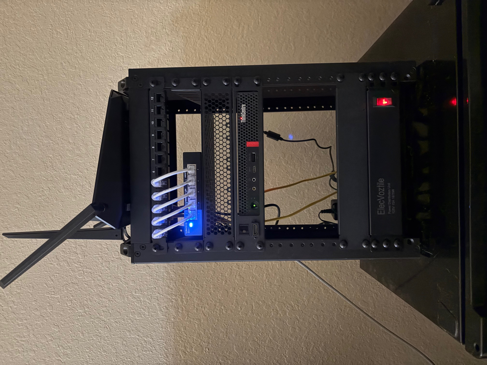
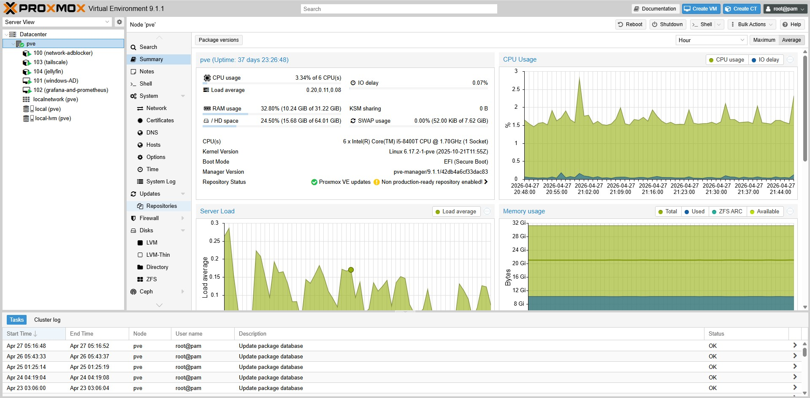
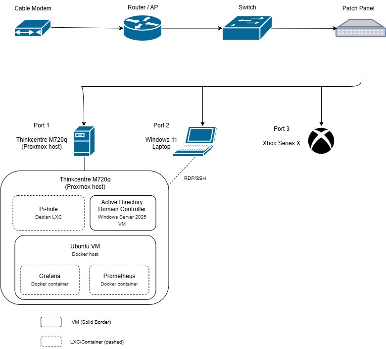

# Homelab
Self-hosted homelab running Proxmox on a Lenovo ThinkCentre M720q. I built this project so that I could add self-hosted projects to my home network, and so I can play around and improve my Linux and networking concepts. I've already hosted some things like a network-wide adblocker using Pi-hole, a Windows Server 2025 VM to play around with Active Directory, and Grafana + Prometheus to create custom dashboards for system metrics. I plan to continue expanding with self-hosted cloud storage, a media server, and more.

  
  

## Architecture

## Infrastructure
The homelab runs on a single Lenovo ThinkCentre M720q mini PC with the following specs:

| Component | Details |
|---|---|
| CPU | Intel Core i5-8500T |
| RAM | 32GB DDR4 |
| Storage | 240GB SATA SSD (upgrading to 1TB) |
| OS | Proxmox VE |

## Services
| Service | Technology | Purpose |
|---|---|---|
| Pi-hole | Debian 12 LXC | DNS-based network-wide ad blocker with custom blocklists |
| Active Directory | Windows Server 2025 VM | Sandbox for learning AD - created OUs, users, and practiced administrative tasks like password resets |
| Grafana + Prometheus | Ubuntu VM with Docker | Collects system metrics and displays them in custom dashboards |
