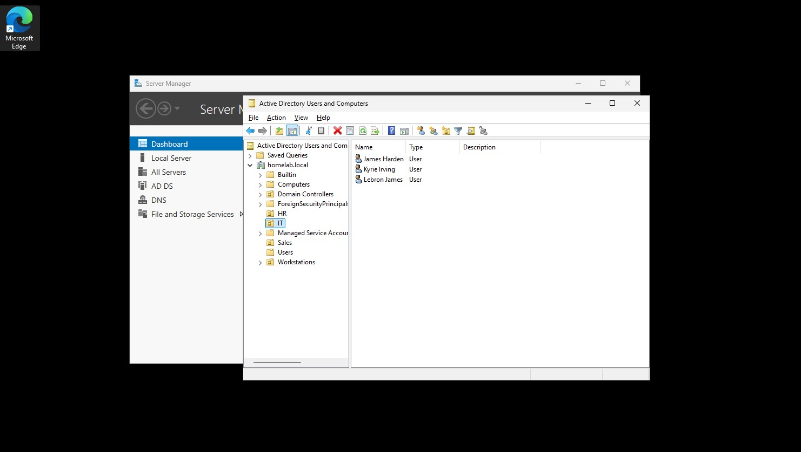
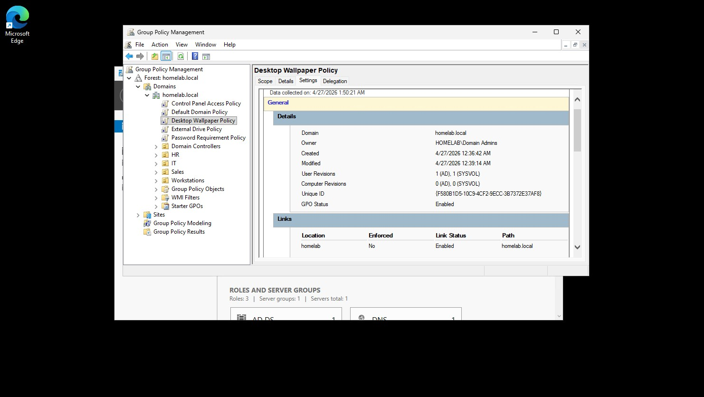
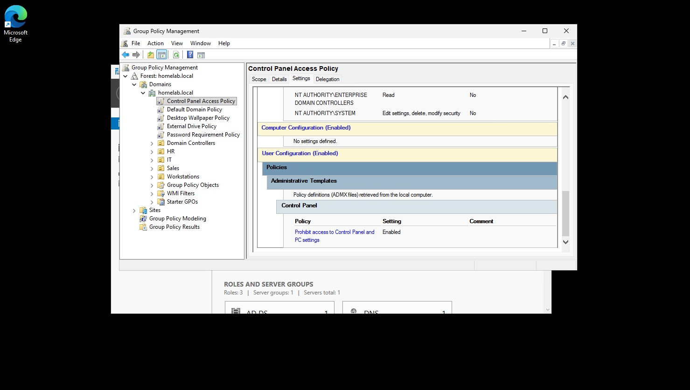

# Active Directory Enterprise Simulation #

This project is a functional implementation of Windows Server 2025 running within a virtual machine. The goal was to build a working domain environment from scratch to practice User Management (IAM) and Group Policy administration.

## Setup ##
- Environment: Windows Server 2025 (VM)
- Core services: Active Directory Domain Services and DNS

## Domain Organization (OUs) ##
I configured the directory using Organizational Units (OUs) to simulate a business hierarchy. This allows for specific policies to be targeted at different groups:
- IT: Dedicated users for administrative tasks.
- HR: Simulated departmental user accounts.
- Sales: Simulated departmental user accounts.

## Applied Group Policies (GPOs) ##
I created security and configuration rules across the domain.
- Password Requirements Policy: Enforced complexity, length, and age requirements for all domain users. Passwords must be at least 6 characters, contain an upper case letter, lower case letter, and a symbol, and must be changed every 90 days.
- External Drive Policy: Disabled the use of USB/external storage to prevent unauthorized data transfer.
- Desktop Wallpaper Policy: Configured a mandatory desktop wallpaper policy to prevent users from changing their computer's wallpaper and demonstrate environment-wide configuration control.
- Control Panel Access Policy: Prevented users from being able to access their computer's control panel so they can't change any important settings.
<table align="center">
  <tr>
    <td align="center"><b>Password Policy</b> </td>
    <td align="center"><b>External Drive Policy</b> </td>
  </tr>
  <tr>
    <td align="center"><b>Desktop Wallpaper Policy</b> </td>
    <td align="center"><b>Control Panel Access Policy</b> </td>
  </tr>
</table>

