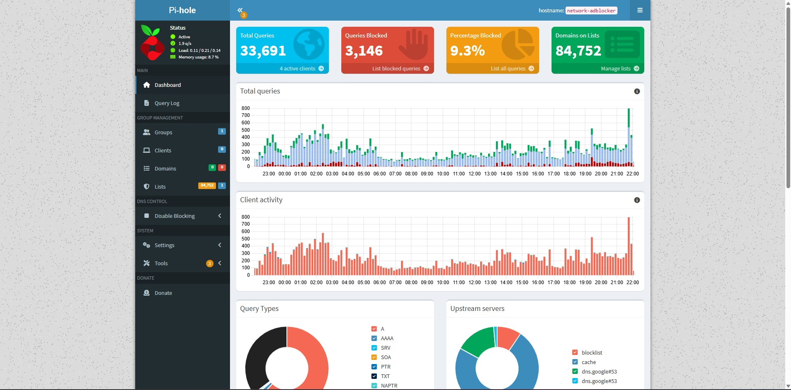

# Pi-hole: Network-Wide Ad and Tracker Blocking #
This project involves the deployment and configuration of Pi-hole, a DNS sinkhole designed to provide network-wide advertisement and tracker blocking. By intercepting DNS queries, this service enhances privacy, reduces bandwidth consumption, and provides a layer of security by blocking known malicious domains before they can resolve.

